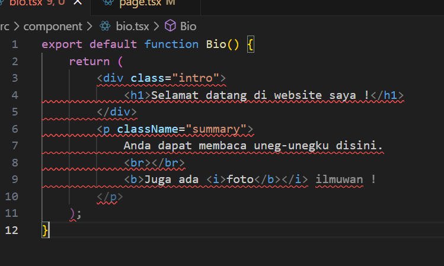

Nama : Muhammad Ali Reza  
NIM : 2041720182  
Kelas : TI 3F  

## SOAL 1

Untuk mengatasi error tersebut kita harus memasukkan atau menginisiasi domain image karena data image tidak dapat diload di browser, sehingga kita harus memasukkan domain image yang terdapat pada file profile.tsx ke dalam file next.config.mjs.

## SOAL 2

Membuat komponen baru yang bernama gallery yang berformat tsx dan didalam gallery terdapat import dari komponen profile menggunakan import default dan tampilannya seperti digambar hal ini bisa mempermudah jika ingin memanggil komponen yang banyak yang dapat digunakan kembali.

## SOAL 3

Error tersebut terjadi karena belum menggunakan sintaks JSX dengan benar. JSX adalah sintaks yang mirip dengan HTML dan digunakan dalam React untuk menulis UI. Namun, ada beberapa perbedaan penting antara JSX dan HTML, seperti penggunaan className alih-alih class, dan keharusan untuk menutup semua elemen.
Kode Error

Hasil run dari kode

Kode setelah diperbaiki menggunakan jsx conventer

Hasil Run
